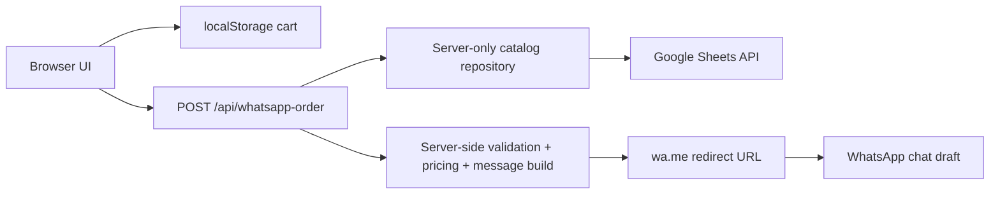
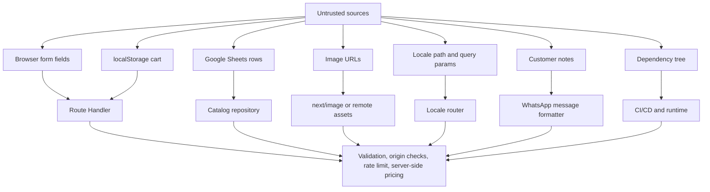

# Security and Reliability Research Report for a Next.js WhatsApp Commerce Storefront

## Executive summary

A modern JavaScript storefront like the one you described is exposed to the usual web-application risks, but its **highest-risk failure modes are unusually concentrated in business logic, trust boundaries, and privacy leakage** rather than in classical payment processing. In this architecture, the browser holds a mutable cart in `localStorage`, the catalog comes from Google Sheets, the server turns client input into a WhatsApp redirect, and the user can still edit the message before sending it. That combination makes **client-side price trust, product/variant mismatch, attacker-controlled redirects, sensitive data in URLs, stored-XSS through catalog content, and abuse of the order endpoint** the most important issues to solve first. OWASP’s current guidance is explicit that client state is input, not truth; prices and permissions must be re-derived on the server, workflows should be explicit state machines, and abuse-prone features must be rate-limited and monitored. citeturn16view3turn17view4turn0search16turn0search12

For this project, the safest design is: **server-only Google Sheets access, strict Zod validation, authoritative server-side price/variant resolution, fixed `wa.me` destination, same-origin protection on the order endpoint, image-host allowlisting, no sensitive data in browser storage, no raw HTML rendering, strong security headers, and high-signal tests for tampering**. That baseline aligns with OWASP Top 10 and ASVS, Next.js data-security guidance, and Google’s guidance to prefer short-lived service-account credentials and treat service-account keys as risky credentials that must be tightly protected and rotated. citeturn0search1turn18search0turn13view8turn25view0turn25view1

There is also a **privacy-specific design problem** in WhatsApp checkout flows: a prefilled order is encoded into a URL query string. OWASP and CWE both warn that sensitive data in URLs can leak through browser history, logs, screenshots, shared devices, and intermediaries, even when HTTPS is used. For that reason, the **best privacy posture** is to keep the WhatsApp URL minimal and move the full address into a server-side draft referenced by an order ID; if the business insists on including full address in the prefilled text, treat it as a deliberate privacy tradeoff and disclose it internally as such. citeturn27search0turn27search1turn27search9

Operationally, the stack is viable for **30–100 products** if the Sheets integration is implemented as a server-only repository using `batchGet`, short caching windows, and exponential backoff. Google documents per-minute read limits and recommends backoff on `429` responses; Node documents that blocking the event loop hurts both performance and security; Next.js documents persistent caching/revalidation controls that can absorb catalog reads for a storefront of this size. citeturn24view0turn13view7turn15view0turn9search5turn9search12

For hosting, **Vercel Pro** is the best fit for the exact stack because Vercel provides zero-config Next.js deployment, built-in logs/observability, and first-party WAF/rate limiting. Vercel’s own terms also make clear that the Hobby plan is for personal, non-commercial use only, so a commercial storefront should not ship there. Netlify and Cloudflare are both defensible alternatives, but both currently rely on platform adapters around Next.js support; Next.js itself distinguishes “verified adapters” from other platform integrations where compatibility may vary. citeturn7search1turn7search4turn7search8turn7search12turn19search3turn7search2turn7search7

## Threat model and attack surface

The application has four primary trust boundaries: **browser storage**, **server route handlers**, **Google Sheets as external content source**, and **WhatsApp as external checkout destination**. OWASP’s input-validation guidance is clear that all potentially untrusted sources must be validated, and that includes backend feeds and partner systems, not just the browser. In your case, that means **Google Sheets rows are untrusted input**, not configuration. citeturn17view5

The most important architectural fact is that **Next.js App Router gives you a real server/client boundary**, but only if you use it intentionally. Next.js documents that Server Components can access private data and APIs while Client Components cannot; Next.js also documents `NEXT_PUBLIC_` as the explicit mechanism for exposing environment variables to the browser. That means Sheets credentials, service-account material, order construction, and destination phone-number logic must all live behind server-only modules and route handlers. citeturn18search0turn18search2turn12search4

The user journey also creates a subtle logic risk: WhatsApp Click to Chat opens a conversation with a prefilled message, but the customer can edit that message before sending. As a result, a redirect to WhatsApp is **not an order confirmation**, only a **draft handoff**. Any process that treats “redirect succeeded” as “order placed” will be logically wrong and easy to abuse or break. citeturn6search0turn6search1turn6search4



The data flow above is safe only if the browser is treated as mutable, the server as authoritative, and Google Sheets as an untrusted content source that must be normalized before rendering or use in business logic. That separation is the core defense against the highest-value storefront attacks. citeturn17view4turn17view5turn18search0



For multilingual `ar/fr/en` rendering, there is one more attack surface: **mixed-direction text**. W3C documents that inserting user strings into RTL and LTR contexts can display incorrectly or misleadingly, and MDN documents that `dir="rtl"` changes table ordering and layout behavior. In practice, that means SKUs, phone numbers, prices, and Latin product codes inside Arabic pages or WhatsApp messages should be wrapped with `bdi` or otherwise direction-isolated, and dangerous bidi control characters should be stripped from untrusted free text. citeturn11search2turn11search1turn11search18

## Taxonomy of vulnerabilities and common logic flaws

### High-value issues by class

The table below focuses on the storefront classes that matter most for your stack and constraints.

| Issue class | Affected component | Exploit or failure example | Why it matters here | Primary fix |
|---|---|---|---|---|
| Client-side trust of prices/totals | Cart, checkout submission | Attacker edits `localStorage` or request JSON to change price or subtotal | OWASP explicitly warns that security-relevant values must be re-derived on the server; client state is input, not truth. citeturn17view4 | Send only `{productId, variantId, quantity}` from client; resolve active product, variant, and current price on server |
| Product/variant mismatch | Checkout API | Valid product ID with a variant from a different product | Classic e-commerce business-logic flaw; easy to miss if schemas are checked independently. citeturn16view3turn10search12 | Validate relational integrity server-side before building message |
| Stored XSS from Sheets | Product name, description, badges, FAQs | Malicious HTML/JS inserted into Google Sheets row and rendered into page | Next/React reduce XSS risk, but OWASP documents framework escape hatches and warns against `dangerouslySetInnerHTML` and unsafe URLs. citeturn17view2 | Disallow HTML in catalog fields; render as text only; validate links and schemes |
| Sensitive data in WhatsApp URL | Redirect URL, logs, browser history | Full address and phone encoded in `wa.me?...text=` | OWASP and CWE warn against sensitive data in query strings. citeturn27search0turn27search1turn27search9 | Prefer draft-reference flow; if unavoidable, minimize fields and never log full URL |
| Secret leakage to client | Next.js env + component boundary | Service-account material ends up in client bundle via `NEXT_PUBLIC_` or bad imports | Next.js documents `NEXT_PUBLIC_` exposure and server/client boundaries. citeturn18search2turn18search0turn12search4 | `server-only` modules, schema-validated env, zero secrets in client components |
| Abuse of order endpoint | `/api/whatsapp-order` | Bot or cross-site page spams merchant with thousands of prefills | OWASP recommends defense in depth, origin checks, and rate limiting for state-changing requests. citeturn16view5turn17view1 | Same-origin verification, Fetch Metadata checks, Vercel WAF/rate limits, anti-automation logging |
| Open redirect / attacker-controlled destination | Redirect builder | User-controlled phone number or custom URL produces malicious external redirect | OWASP warns against unvalidated redirects; WhatsApp requires `wa.me/<number>` with international number format. citeturn10search20turn6search1 | Fix host and destination number server-side; never accept from user |
| SSRF-like remote asset abuse | Product images, future importers | Broad image domain allowlist lets attacker point server-side fetches at internal or hostile targets | OWASP documents URL mishandling and image-fetch SSRF patterns. Next.js documents strict `remotePatterns`. citeturn17view3turn18search3turn18search7 | Strict image allowlist or self-host images; reject arbitrary remote URLs |
| Privacy leakage in logs | Runtime logs, analytics, traces | Logs include full address, phone, customer notes, or full `wa.me` URL | OWASP logging guidance says log enough for defense, but not too much; sensitive query strings are especially risky. citeturn17view1turn27search0 | Redact PII, never log full WhatsApp URL, segregate audit and app logs |
| Google Sheets availability and quota failure | Catalog repository | Burst traffic triggers Sheets `429`, long tail latency, or timeout | Google documents read quotas, 180-second max processing, and exponential backoff. citeturn13view7turn24view0 | `batchGet`, caching/revalidation, timeout, retry/backoff, stale fallback |
| Event-loop blocking / regex DoS | Route handlers, parsing, search | Expensive sync work turns small abuse into availability issue | Node warns that blocking the event loop harms performance and security. citeturn15view0 | Avoid sync crypto/compression/parsing in request path; profile hot routes |
| Dependency compromise / outdated framework | npm supply chain, Next.js runtime | Vulnerable dependency or unpatched Next.js release | GitHub, npm, and Next.js all provide tooling/guidance; Next.js now issues formal security releases. citeturn8search0turn8search1turn20search2turn18search16 | Required Dependabot, dependency review, CodeQL, `npm audit`, prompt patching |

### Project-specific logic flaws

The most common **logic** bugs in WhatsApp storefronts are not injection bugs; they are **workflow** bugs. OWASP’s business-logic guidance is explicit that flows should be modeled as state machines, not UI assumptions. For this project, the main examples are: allowing submit with an invalid or inactive variant, failing to merge identical cart lines, treating redirect as order completion, allowing duplicate draft generation on page refresh, generating totals from browser prices, and letting language or RTL formatting change the meaning of quantities or SKUs. citeturn17view4

A second class is **reliability logic**. If the catalog is fetched on every render or every keystroke, small traffic spikes can exhaust Sheets quotas. If the server builds the WhatsApp message from stale cache while the product page shows fresh data, the merchant and customer can see different prices. If the customer note contains line breaks or bidi controls, the message may become misleading rather than malicious. These are not “CVEs,” but in production they cause real order loss and support burden. Google’s quota model and W3C’s bidi guidance both make these risks concrete. citeturn13view7turn24view0turn11search2

## Prioritized risk matrix

The matrix below combines **severity** and **likelihood** for your exact constraints rather than for generic e-commerce.

| Priority | Risk | Severity | Likelihood | Why it ranks here | Immediate mitigation |
|---|---|---:|---:|---|---|
| Highest | Server trusting browser cart/prices | Critical | High | Trivial to tamper with browser storage or network payload; directly affects order integrity | Recompute all prices and totals on server from authoritative catalog |
| Highest | Sensitive PII in `wa.me` query string | High | High | The architecture naturally pushes address/phone into a URL | Switch to minimal-message mode or server-stored draft reference |
| Highest | Stored XSS from catalog content | High | Medium | Sheets is a non-code CMS and therefore a realistic injection source | Text-only rendering, no raw HTML, scheme validation |
| Highest | Order endpoint abuse/spam | High | High | Public, unauthenticated endpoint is easy to farm | Origin/Fetch-Metadata checks, rate limiting, alerting |
| High | Secret leakage via bad Next.js boundary | Critical | Medium | One bad import or `NEXT_PUBLIC_` can expose credentials | `server-only`, env schema validation, CI scans |
| High | Product/variant mismatch and inactive item checkout | High | Medium | Common logic flaw in variant-based storefronts | Referential validation, stock/active checks |
| High | SSRF-like image URL abuse | High | Medium | Sheets-driven image URLs often get over-trusted | `remotePatterns`, allowlist domains, re-host images |
| High | Dependency or framework vulnerabilities | High | Medium | Next.js has active monthly security releases; npm ecosystem risk is persistent | Dependabot, CodeQL, `npm audit`, prompt upgrades |
| Medium | Sheets quota/timeouts causing broken pages | Medium | High | Small catalog but external API with documented limits | Cache, `batchGet`, retries, stale fallback |
| Medium | Duplicate submissions / racey drafts | Medium | Medium | Users refresh, re-click, or edit flow across tabs | Idempotency key, short server-side draft TTL |
| Medium | Mixed RTL/LTR text spoofing or confusion | Medium | Medium | Arabic locale plus Latin SKUs/prices makes this realistic | `dir`, `bdi`, strip bidi overrides from untrusted input |
| Medium | Logging too much or too little | Medium | Medium | Easy to log PII or miss abuse signals | Redacted structured logs + alerting schema |
| Medium | Event loop blocking | Medium | Low | Request path is light, but abuse magnifies sync hot spots | Avoid sync heavy ops, profile in CI |
| Lower | CSRF-style cross-site triggering | Medium | Low to Medium | No account session, but endpoint can still be abused from another site | Origin + Fetch Metadata + rate-limiting |
| Lower | Cache confusion across locales | Medium | Low | Easy to mis-key caches in multilingual apps | Locale-aware cache keys and tests |

A notable current operational risk is patch lag: Next.js announced a formal security release model in July 2026 and published a July 2026 security release addressing multiple high- and medium-severity issues in supported LTS lines. On a public storefront, this moves dependency patching from “good hygiene” to “required operations.” citeturn18search16turn18search19

## Concrete remediation steps and code-level fixes

### Make the server authoritative

The browser should store **only** the minimal cart tuple: `productId`, `variantId`, and `quantity`. OWASP’s HTML5 guidance says local storage is acceptable only for data that does not assume authentication or authorization, and explicitly warns that data in `localStorage` is readable and writable by injected JavaScript. That makes it suitable for an unauthenticated cart, but not for prices, PII, or anything trusted. citeturn17view0

```ts
// src/lib/security/schemas.ts
import { z } from 'zod';

const BIDI_UNSAFE = /[\u202A-\u202E\u2066-\u2069]/g;

const safeText = (max: number) =>
  z.string()
    .trim()
    .min(1)
    .max(max)
    .transform((s) => s.normalize('NFKC').replace(BIDI_UNSAFE, ''));

export const LocaleSchema = z.enum(['ar', 'fr', 'en']);

export const CheckoutRequestSchema = z.object({
  locale: LocaleSchema,
  customer: z.object({
    name: safeText(100),
    phone: z.string().trim().min(6).max(30),
    city: safeText(100),
    address: safeText(250),
    notes: z.string().trim().max(500).optional()
      .transform((s) => s?.normalize('NFKC').replace(BIDI_UNSAFE, '')),
  }),
  items: z.array(
    z.object({
      productId: z.string().trim().regex(/^prod_[a-zA-Z0-9_-]{1,64}$/),
      variantId: z.string().trim().regex(/^var_[a-zA-Z0-9_-]{1,64}$/),
      quantity: z.number().int().min(1).max(99),
    })
  ).min(1).max(100),
}).strict();

export type CheckoutRequest = z.infer<typeof CheckoutRequestSchema>;
```

This schema does four jobs at once: it fixes the locale allowlist, enforces quantity bounds, rejects schema drift, and strips bidi override characters from free text that could make Arabic/Latin mixed output misleading. The input-validation rationale comes directly from OWASP; the bidi risk is drawn from W3C guidance on mixed-direction strings. citeturn17view5turn11search2turn11search18

```ts
// src/lib/orders/resolve-order.ts
type Product = {
  id: string;
  active: boolean;
  stockStatus: 'in_stock' | 'out_of_stock';
  basePriceMad: number;
  names: Record<'ar' | 'fr' | 'en', string>;
};

type Variant = {
  id: string;
  productId: string;
  active: boolean;
  stockStatus: 'in_stock' | 'out_of_stock';
  sku: string;
  priceAdjustmentMad: number;
  labels: Record<'ar' | 'fr' | 'en', string>;
};

export function resolveOrder(
  locale: 'ar' | 'fr' | 'en',
  items: Array<{ productId: string; variantId: string; quantity: number }>,
  products: Map<string, Product>,
  variants: Map<string, Variant>,
) {
  let subtotalMad = 0;

  const lines = items.map((item) => {
    const product = products.get(item.productId);
    const variant = variants.get(item.variantId);

    if (!product || !variant) {
      throw new Error('Unknown product or variant.');
    }

    if (variant.productId !== product.id) {
      throw new Error('Variant does not belong to product.');
    }

    if (!product.active || !variant.active) {
      throw new Error('Inactive item.');
    }

    if (product.stockStatus !== 'in_stock' || variant.stockStatus !== 'in_stock') {
      throw new Error('Out of stock.');
    }

    const unitPriceMad = product.basePriceMad + variant.priceAdjustmentMad;
    if (!Number.isFinite(unitPriceMad) || unitPriceMad < 0) {
      throw new Error('Invalid price data.');
    }

    const lineTotalMad = unitPriceMad * item.quantity;
    subtotalMad += lineTotalMad;

    return {
      productId: product.id,
      variantId: variant.id,
      name: product.names[locale],
      variantLabel: variant.labels[locale],
      sku: variant.sku,
      unitPriceMad,
      quantity: item.quantity,
      lineTotalMad,
    };
  });

  return { lines, subtotalMad };
}
```

This is the single most important logic fix in the whole system: **the server re-resolves every line item and recalculates every money value from the authoritative catalog**, matching OWASP’s business-logic guidance. citeturn17view4

### Keep Google Sheets server-only and resilient

Next.js recommends keeping private data in Server Components and route handlers. At the same time, Google documents that Sheets has per-minute quotas and supports reading multiple ranges with `batchGet`, which is exactly what a small storefront should use. citeturn18search0turn24view0turn13view7

```ts
// src/lib/catalog/sheets-repository.ts
import 'server-only';

import { unstable_cache } from 'next/cache';
import { GoogleAuth } from 'google-auth-library';

const env = {
  spreadsheetId: process.env.GOOGLE_SHEETS_SPREADSHEET_ID!,
  serviceAccountEmail: process.env.GOOGLE_SERVICE_ACCOUNT_EMAIL!,
  privateKey: process.env.GOOGLE_PRIVATE_KEY!.replace(/\\n/g, '\n'),
};

const auth = new GoogleAuth({
  credentials: {
    client_email: env.serviceAccountEmail,
    private_key: env.privateKey,
  },
  scopes: ['https://www.googleapis.com/auth/spreadsheets.readonly'],
});

async function fetchCatalogBundle() {
  const client = await auth.getClient();
  const token = await client.getAccessToken();
  const url = new URL(
    `https://sheets.googleapis.com/v4/spreadsheets/${env.spreadsheetId}/values:batchGet`
  );

  for (const range of ['Products!A:Z', 'Variants!A:Z', 'Categories!A:Z', 'Settings!A:B']) {
    url.searchParams.append('ranges', range);
  }

  const res = await fetch(url, {
    headers: { Authorization: `Bearer ${token.token}` },
    signal: AbortSignal.timeout(5000),
    // Prevent accidental user-specific caching; use app-level cache below instead.
    cache: 'no-store',
  });

  if (res.status === 429) {
    throw new Error('Sheets rate limited');
  }
  if (!res.ok) {
    throw new Error(`Sheets fetch failed: ${res.status}`);
  }

  return res.json() as Promise<unknown>;
}

export const getCatalogBundle = unstable_cache(
  async () => {
    // Parse response with Zod in real code before returning normalized entities.
    return fetchCatalogBundle();
  },
  ['catalog-bundle-v1'],
  { revalidate: 60, tags: ['catalog'] },
);
```

This pattern is tailored to the documented constraints: use `batchGet` to fetch multiple ranges in one request, cache for a short interval, and bound the request with a timeout so a slow Sheets response does not pin a serverless invocation. Google explicitly recommends exponential backoff on quota errors; you should add that around the underlying fetch rather than retrying indefinitely. citeturn24view0turn13view7turn9search5

Google’s service-account guidance also changes how you should think about this module. Google documents that short-lived credentials are safer than long-lived credentials and that service-account keys are risky if mismanaged. If you must use a key outside GCP, keep it server-only, never store it in source control, rotate it, and constrain privileges to read-only Sheets access. citeturn13view8turn25view0turn25view1

### Harden the order endpoint

The order endpoint is where integrity, abuse prevention, and privacy all converge. It should verify same-origin conditions, avoid caching, resolve the cart server-side, and return a URL with a fixed destination. OWASP’s CSRF guidance recommends origin verification and Fetch Metadata as practical defense-in-depth measures for modern browsers, and Vercel provides first-party rate limiting through WAF/SDK features. citeturn16view5turn9search0turn9search1

```ts
// src/app/api/whatsapp-order/route.ts
import { NextRequest, NextResponse } from 'next/server';
import { CheckoutRequestSchema } from '@/lib/security/schemas';
import { getCatalogBundle } from '@/lib/catalog/sheets-repository';
import { resolveOrder } from '@/lib/orders/resolve-order';

const WHATSAPP_PHONE = process.env.WHATSAPP_PHONE_NUMBER!; // digits only, server-only

function assertSameOrigin(request: NextRequest) {
  const origin = request.headers.get('origin');
  const host = request.headers.get('x-forwarded-host') ?? request.headers.get('host');
  const site = request.headers.get('sec-fetch-site');

  if (site && !['same-origin', 'same-site', 'none'].includes(site)) {
    throw new Error('Cross-site request blocked');
  }

  if (origin && host) {
    const parsed = new URL(origin);
    if (parsed.host !== host) {
      throw new Error('Origin mismatch');
    }
  }
}

function buildWaMeUrl(phone: string, text: string) {
  // Destination host and number are fixed by server config.
  return `https://wa.me/${phone}?text=${encodeURIComponent(text)}`;
}

export async function POST(request: NextRequest) {
  try {
    assertSameOrigin(request);

    // Production: enforce host-level rate limiting with Vercel WAF and app-level abuse logging.
    const body = await request.json();
    const parsed = CheckoutRequestSchema.safeParse(body);
    if (!parsed.success) {
      return NextResponse.json({ error: 'Invalid request.' }, { status: 400 });
    }

    const catalog = await getCatalogBundle();
    // mapCatalog(...) should Zod-validate rows and reject malformed Sheets data.
    const { products, variants } = mapCatalog(catalog);

    const order = resolveOrder(parsed.data.locale, parsed.data.items, products, variants);
    const message = buildLocalizedWhatsAppMessage({
      locale: parsed.data.locale,
      customer: parsed.data.customer,
      lines: order.lines,
      subtotalMad: order.subtotalMad,
      // Prefer reference-only mode for privacy if business allows.
      privacyMode: process.env.WHATSAPP_MESSAGE_MODE === 'full' ? 'full' : 'minimal',
    });

    const url = buildWaMeUrl(WHATSAPP_PHONE, message);

    return NextResponse.json(
      { url },
      {
        headers: {
          'Cache-Control': 'no-store',
        },
      },
    );
  } catch {
    return NextResponse.json(
      { error: 'Unable to prepare order.' },
      { status: 400, headers: { 'Cache-Control': 'no-store' } },
    );
  }
}
```

Two details matter here. First, **the phone number is fixed and server-side**, which removes open-redirect and message-exfiltration classes related to attacker-controlled destinations. Second, the endpoint returns `no-store`, so order payloads and generated URLs are not cached by shared intermediaries or browsers beyond normal history behavior. citeturn6search1turn10search20turn12search3

If you keep the current UX, the safer message builder is a **minimal** one:

```ts
type PrivacyMode = 'minimal' | 'full';

export function buildLocalizedWhatsAppMessage(input: {
  locale: 'ar' | 'fr' | 'en';
  customer: { name: string; phone: string; city: string; address: string; notes?: string };
  lines: Array<{
    name: string; variantLabel: string; sku: string;
    unitPriceMad: number; quantity: number; lineTotalMad: number;
  }>;
  subtotalMad: number;
  privacyMode: PrivacyMode;
}) {
  const fmt = new Intl.NumberFormat(
    input.locale === 'ar' ? 'ar-MA' : input.locale === 'fr' ? 'fr-MA' : 'en-MA',
    { style: 'currency', currency: 'MAD' },
  );

  const customerBlock =
    input.privacyMode === 'full'
      ? [
          `Name: ${input.customer.name}`,
          `Phone: ${input.customer.phone}`,
          `City: ${input.customer.city}`,
          `Address: ${input.customer.address}`,
          input.customer.notes ? `Notes: ${input.customer.notes}` : undefined,
        ].filter(Boolean).join('\n')
      : [
          `Name: ${input.customer.name}`,
          `Phone: ${input.customer.phone}`,
          `City: ${input.customer.city}`,
          `Order reference will be used for address confirmation.`,
        ].join('\n');

  const items = input.lines.map((line, i) =>
    [
      `${i + 1}. ${line.name}`,
      `Variant: ${line.variantLabel}`,
      `SKU: ${line.sku}`,
      `Unit: ${fmt.format(line.unitPriceMad)}`,
      `Qty: ${line.quantity}`,
      `Total: ${fmt.format(line.lineTotalMad)}`,
    ].join('\n')
  ).join('\n\n');

  return [
    'New order',
    '',
    customerBlock,
    '',
    items,
    '',
    `Subtotal: ${fmt.format(input.subtotalMad)}`,
    'Delivery: To be confirmed on WhatsApp',
  ].join('\n');
}
```

`Intl.NumberFormat` is the correct way to keep currency output locale-consistent, and for Arabic UI you should isolate inline LTR values like SKU and phone visually with `bdi` in HTML views. W3C and MDN both document why mixed-direction strings can otherwise display incorrectly. citeturn11search3turn11search2turn11search18

### Lock down rendering, assets, and headers

OWASP’s XSS, SSRF, and HTTP-header guidance maps directly to your stack: do not render raw HTML from Sheets, validate URLs, restrict remote images, and use CSP plus standard browser security headers. Next.js specifically recommends strict `remotePatterns` and documents exact matching behavior for image hosts. citeturn17view2turn17view3turn27search16turn18search3turn18search7

```ts
// next.config.ts
import type { NextConfig } from 'next';

const nextConfig: NextConfig = {
  poweredByHeader: false,

  images: {
    remotePatterns: [
      {
        protocol: 'https',
        hostname: 'cdn.example.com',
        pathname: '/products/**',
      },
      {
        protocol: 'https',
        hostname: 'images.example-mall.com',
        pathname: '/catalog/**',
      },
    ],
  },

  async headers() {
    return [
      {
        source: '/:path*',
        headers: [
          { key: 'Referrer-Policy', value: 'strict-origin-when-cross-origin' },
          { key: 'X-Content-Type-Options', value: 'nosniff' },
          { key: 'X-Frame-Options', value: 'DENY' },
          { key: 'Permissions-Policy', value: 'camera=(), microphone=(), geolocation=()' },
          {
            key: 'Content-Security-Policy',
            value: [
              "default-src 'self'",
              "base-uri 'self'",
              "frame-ancestors 'none'",
              "object-src 'none'",
              "img-src 'self' https://cdn.example.com https://images.example-mall.com data:",
              "style-src 'self'",
              "script-src 'self'",
              "connect-src 'self'",
              "form-action 'self' https://wa.me https://api.whatsapp.com",
              'upgrade-insecure-requests',
            ].join('; '),
          },
        ],
      },
    ];
  },
};

export default nextConfig;
```

One important tradeoff: Next.js documents that nonce-based CSP requires **dynamic rendering**, because the nonce is attached during server-side rendering. Since your catalog is mostly static and only the order endpoint is dynamic, you should prefer a CSP that avoids inline scripts altogether rather than reaching for per-request nonces everywhere and accidentally giving up static/ISR performance. citeturn18search1turn19search0

### Protect privacy in storage and logging

The safest rule for this app is simple: **cart in `localStorage`, customer details in memory or `sessionStorage`, nothing sensitive in logs, nothing secret in browser bundles**. OWASP explicitly recommends avoiding sensitive data in `localStorage` and notes that `sessionStorage` is preferable where persistence is not needed. Separately, OWASP logging guidance emphasizes that logging should support security events and operations without becoming a new source of sensitive-data exposure. citeturn17view0turn17view1

```ts
// src/lib/observability/redact.ts
type SafeOrderLog = {
  locale: string;
  itemCount: number;
  productIds: string[];
  city?: string;
  hadNotes: boolean;
};

export function redactOrderForLog(input: {
  locale: string;
  items: Array<{ productId: string }>;
  customer: { city: string; notes?: string };
}): SafeOrderLog {
  return {
    locale: input.locale,
    itemCount: input.items.length,
    productIds: input.items.map((i) => i.productId),
    city: input.customer.city,
    hadNotes: Boolean(input.customer.notes),
  };
}
```

Do **not** log the full generated WhatsApp URL. In this architecture, that URL may contain customer name, phone, address, city, and notes. That would create a secondary sensitive-data leak even if your frontend never stores the data elsewhere. OWASP’s guidance on sensitive query strings and logging makes this one of the highest-leverage privacy fixes you can implement. citeturn27search0turn27search9turn17view1

### Keep the implementation maintainable

For maintainability, the controls that matter most are not stylistic; they are architectural. NIST’s SSDF emphasizes integrating secure practices into the SDLC, and OWASP ASVS exists precisely so teams can keep security controls testable and repeatable rather than ad hoc. For this codebase, that means: one repository interface for catalogs, one centralized checkout schema, one message formatter, one money formatter, one locale dictionary system, and contract tests that fail when the Google Sheets column contract changes. citeturn1search2turn0search1

That also means **do not duplicate the component tree per locale**. Next.js supports locale-aware routing in App Router, so the maintainable pattern is shared components plus dictionaries and `dir`/`lang` metadata, not three separate storefronts. citeturn11search0turn11search1

## Verification, CI, monitoring, and incident response

### Tests that should exist before production

The most valuable tests are the ones that prove the server does **not** trust the browser. Playwright is a strong fit here because it supports storage manipulation, mobile emulation, CI execution, traces, and video artifacts. Playwright’s own docs recommend traces for CI debugging and confirm that browser storage state includes `localStorage`. citeturn5search0turn13view6turn5search13

```ts
// tests/unit/resolve-order.test.ts
import { describe, it, expect } from 'vitest';
import { resolveOrder } from '@/lib/orders/resolve-order';

describe('resolveOrder', () => {
  it('rejects a variant that belongs to another product', () => {
    const products = new Map([
      ['prod_1', { id: 'prod_1', active: true, stockStatus: 'in_stock', basePriceMad: 100, names: { ar: 'أ', fr: 'A', en: 'A' } }],
    ]);

    const variants = new Map([
      ['var_9', { id: 'var_9', productId: 'prod_other', active: true, stockStatus: 'in_stock', sku: 'SKU', priceAdjustmentMad: 0, labels: { ar: 'س', fr: 'S', en: 'S' } }],
    ]);

    expect(() =>
      resolveOrder('en', [{ productId: 'prod_1', variantId: 'var_9', quantity: 1 }], products, variants)
    ).toThrow(/does not belong/i);
  });

  it('ignores any client-side price because no price field is accepted', () => {
    // This is enforced by the Zod request schema: client price is not part of the contract.
    expect(true).toBe(true);
  });
});
```

```ts
// tests/e2e/cart-tampering.spec.ts
import { test, expect } from '@playwright/test';

test('server rejects tampered cart data', async ({ page }) => {
  await page.goto('/fr');

  await page.evaluate(() => {
    localStorage.setItem('store-cart-v1', JSON.stringify([
      {
        productId: 'prod_1',
        variantId: 'var_belongs_to_other_product',
        quantity: 99
      }
    ]));
  });

  await page.goto('/fr/checkout');
  await page.getByLabel('Name').fill('Test User');
  await page.getByLabel('Phone').fill('0612345678');
  await page.getByLabel('City').fill('Rabat');
  await page.getByLabel('Address').fill('Hay Riad');
  await page.getByRole('button', { name: /whatsapp/i }).click();

  await expect(page.getByText(/unable to prepare order|invalid/i)).toBeVisible();
});

test('generated redirect uses fixed WhatsApp host', async ({ page }) => {
  await page.goto('/en');
  // Add one valid item through the UI in real test setup.
  // ...
  await page.goto('/en/checkout');
  // Fill fields...
  const [response] = await Promise.all([
    page.waitForResponse((res) => res.url().includes('/api/whatsapp-order') && res.request().method() === 'POST'),
    page.getByRole('button', { name: /whatsapp/i }).click(),
  ]);

  const body = await response.json();
  expect(body.url.startsWith('https://wa.me/')).toBeTruthy();
  expect(body.url).not.toContain('api.whatsapp.evil.example');
});
```

A strong minimum test suite for this storefront should include: schema rejection for extra fields, invalid product/variant linkage, inactive or out-of-stock items, bidi-control stripping from notes, fixed WhatsApp destination, redacted logging, Arabic `dir="rtl"` rendering, locale-aware currency formatting, and quota-failure fallback behavior for Sheets. Those are the tests most likely to catch the failures this architecture actually invites. citeturn11search1turn11search3turn13view7turn17view4

### Recommended GitHub Actions pipeline

GitHub provides first-party dependency review, CodeQL scanning for JavaScript/TypeScript, and Dependabot security updates. npm documents `npm audit` and `npm audit signatures`; Next.js has active security-release cadences; Playwright documents the standard CI install flow and artifact model. Put together, that makes the following baseline pipeline appropriate. citeturn8search0turn8search1turn8search2turn20search0turn20search2turn5search0turn5search8

```yaml
# .github/workflows/ci.yml
name: ci

on:
  pull_request:
  push:
    branches: [main]

jobs:
  quality:
    runs-on: ubuntu-latest
    timeout-minutes: 20
    steps:
      - uses: actions/checkout@v4

      - uses: actions/setup-node@v4
        with:
          node-version: lts/*
          cache: npm

      - run: npm ci
      - run: npx playwright install --with-deps
      - run: npm run lint
      - run: npm run typecheck
      - run: npm run test -- --run
      - run: npm run build
      - run: npm run test:e2e
      - run: npm audit --audit-level=high
      - run: npm audit signatures

      - uses: actions/upload-artifact@v4
        if: failure()
        with:
          name: playwright-report
          path: |
            playwright-report
            test-results

  dependency-review:
    if: github.event_name == 'pull_request'
    runs-on: ubuntu-latest
    permissions:
      contents: read
      pull-requests: write
    steps:
      - uses: actions/checkout@v4
      - uses: actions/dependency-review-action@v4
        with:
          fail-on-severity: high

  codeql:
    runs-on: ubuntu-latest
    permissions:
      actions: read
      contents: read
      security-events: write
    steps:
      - uses: actions/checkout@v4
      - uses: github/codeql-action/init@v3
        with:
          languages: javascript-typescript
          queries: security-extended
      - uses: github/codeql-action/autobuild@v3
      - uses: github/codeql-action/analyze@v3
```

```yaml
# .github/dependabot.yml
version: 2
updates:
  - package-ecosystem: npm
    directory: /
    schedule:
      interval: weekly
    open-pull-requests-limit: 10
    groups:
      frontend-security:
        patterns: ["next", "react*", "@types/*", "zod", "googleapis", "@playwright/*"]
  - package-ecosystem: github-actions
    directory: /
    schedule:
      interval: weekly
```

This pipeline enforces the three supply-chain layers that matter most here: **known-vulnerability detection**, **dependency diff review**, and **static security analysis**. GitHub’s dependency review action is specifically designed to block pull requests that introduce known vulnerable dependency changes, while CodeQL provides built-in JavaScript/TypeScript queries, including the `security-extended` suite. npm’s signature verification adds integrity checking on top of ordinary vulnerability scanning. citeturn8search0turn8search4turn8search12turn8search1turn8search5turn20search0turn20search6

### Monitoring and incident response

For runtime operations, Vercel provides Observability and Runtime Logs, and NIST’s current incident-response guidance emphasizes preparation, detection, analysis, containment, recovery, and improvement as an integrated lifecycle rather than as ad hoc firefighting. SANS’ log-management guidance aligns with the same operational point: logs must be collected, monitored, and used deliberately, not simply accumulated. citeturn9search2turn9search4turn1search0turn23search1turn23search9

For this storefront, monitor at least these signals:

| Signal | Why it matters | Threshold example |
|---|---|---|
| Spike in `POST /api/whatsapp-order` | Abuse, bot traffic, broken frontend loop | Alert on rate > normal baseline by 3–5x |
| Increase in 400s from origin checks | Cross-site abuse or misconfigured frontend origin | Alert on sustained abnormal rate |
| Increase in 429/timeout from Sheets | Quota pressure or catalog dependency outage | Alert immediately; switch to stale catalog fallback |
| Increase in 5xx during checkout | Broken deploy or dependency regression | Page immediately |
| Unusual locale distribution or malformed locale paths | Crawler abuse or router bug | Investigate if outside expected markets |
| Order-message length anomalies | Injection attempts, broken formatting, oversized notes | Alert on extreme percentile |

Your incident-response playbook should be short and specific. Preparation: keep a redaction-safe log schema, artifact retention for failed Playwright runs, and a rollback procedure. Detection: alert on error-rate, abuse-rate, and Sheets quota anomalies. Containment: block abusive origins/IPs at the Vercel WAF layer, disable catalog revalidation if Sheets is unstable, and rotate service-account credentials if exposure is suspected. Recovery: redeploy from last known good commit, revalidate the catalog, and test the critical purchase flow. Post-incident: add a reproducible regression test and update the control matrix. That is directly consistent with NIST SP 800-61’s incident-response lifecycle. citeturn1search0turn9search1turn9search2turn9search4

## Hosting comparison and Supabase migration checklist

### Hosting fit for this stack

| Platform | Fit for this project | Strengths | Trade-offs | Recommendation |
|---|---|---|---|---|
| Vercel Pro | Best fit | Zero-config Next.js deployment, built-in logs/observability, first-party WAF/rate limiting, closest alignment to App Router defaults citeturn7search1turn9search1turn9search2 | Cost above free tier | **Recommended production choice** |
| Vercel Hobby | Not suitable for commercial production | Easy setup for prototypes | Vercel terms restrict Hobby to personal/non-commercial use citeturn7search0turn7search4turn7search12 | Development only |
| Netlify | Good secondary option | Supports major Next.js features via OpenNext adapter citeturn7search2turn7search18 | Adapter layer means more platform-specific testing | Acceptable if team already uses Netlify |
| Cloudflare Workers/Pages | Good for edge-heavy teams | Global platform, Workers support for Next.js through OpenNext-style deployment guidance citeturn7search7turn7search15 | Integration complexity and compatibility validation | Acceptable, but test deeply |
| Self-hosted Node/VPS | Maximum control | Custom WAF, secrets, network topology | You own patching, TLS, logs, backups, scaling, abuse controls | Not recommended for first production launch |

Next.js’ own documentation now distinguishes **verified adapters** from other platform integrations where support and compatibility can vary. At the moment, if your goal is the lowest deployment risk for an App Router storefront, the most conservative choice remains the platform built and documented around Next.js first. citeturn19search3turn7search1

### Supabase migration checklist

Your Google Sheets catalog is acceptable for launch at 30–100 products, but the clean migration path is to move toward **Supabase Database + Storage + optional Auth** once you need stronger administration, drafts, inventory consistency, or privacy-preserving checkout references. Supabase provides first-party guidance for Next.js, SQL migrations, branching environments, and Row Level Security. Supabase also documents RLS as defense in depth, which becomes highly relevant if you eventually expose any catalog or order-draft data directly to the browser. citeturn21search1turn21search6turn21search2turn21search0turn21search16

A safe migration sequence is:

| Stage | Action | Why |
|---|---|---|
| Preparation | Create SQL schema for `categories`, `products`, `variants`, `settings`, and optionally `order_drafts` | Replaces spreadsheet structure with relational integrity |
| Safety baseline | Commit migrations under `supabase/migrations` and use Supabase branches for testing | Prevents drift and supports reviewable changes citeturn21search6turn21search2turn21search10 |
| Data import | Export Sheets to CSV or transform server-side; import into Postgres | Keep source-of-truth transition explicit |
| Image hygiene | Move images from arbitrary third-party URLs into Storage | Eliminates image-host risk and improves cache control |
| Access control | Enable RLS on any browser-accessible tables | Supabase documents RLS as the way to safely expose data to the client citeturn21search0turn21search16 |
| Server secrets | Keep `service_role` server-only; never expose it as `NEXT_PUBLIC_` | Same server/client boundary principle as today |
| Privacy upgrade | Add `order_drafts` with short TTL, and send only order ID + items in WhatsApp URL | Removes full address from query string |
| Optional auth | If you later add admin/auth, use Supabase SSR helpers in Next.js | Supported official path for App Router citeturn21search13turn21search17 |
| Storage access | Use signed URLs for private assets where needed | Supabase Storage documents signed URLs and separate signing keys citeturn21search7turn21search15 |
| Cutover | Switch repository implementation from Sheets to Supabase behind same interface | Preserves frontend and business-logic code |

The key migration design rule is to keep your current `CatalogRepository` abstraction intact. If the repository contract remains stable, you can move from Sheets to Supabase without rewriting search, filtering, cart logic, or message formatting. That is the maintainability payoff of doing the boundary correctly now. citeturn1search2turn0search1

## Final hardening checklist

Before launch, the storefront should satisfy all of the following conditions:

| Control | Required state |
|---|---|
| Catalog access | Server-only repository; no client-side Sheets access |
| Browser storage | Cart only; no prices as truth; no customer PII persisted long-term |
| Checkout schema | Zod-validated, strict, with bounded lengths and quantity limits |
| Order integrity | Server resolves product, variant, stock, and price |
| Redirect safety | Fixed `wa.me` host and fixed destination number |
| Privacy | No full `wa.me` URL in logs; minimal redirect text preferred |
| XSS | No `dangerouslySetInnerHTML`; no untrusted `javascript:`/`data:` URLs |
| Images | Strict `remotePatterns` or self-hosting |
| Abuse resistance | Origin/Fetch Metadata checks + Vercel rate limiting |
| Headers | CSP, `frame-ancestors`/`X-Frame-Options`, `nosniff`, referrer policy |
| Reliability | `batchGet`, cache/revalidate, timeout, exponential backoff |
| Supply chain | Dependabot, dependency review, CodeQL, `npm audit`, patched Next.js LTS |
| i18n/RTL | Locale-aware formatting, `dir`, `bdi`, bidi-control handling |
| Observability | Redacted structured logs, runtime monitoring, rollback + incident playbook |
| Migration readiness | Stable repository interface and migration-tested schemas |

If you enforce that checklist, the residual risk profile becomes reasonable for a first-production WhatsApp commerce launch. If you skip only one family of controls, do not skip the **server-authoritative order resolution** and **privacy minimization for the WhatsApp URL**. Those two controls neutralize the most damaging integrity and privacy failures in this exact architecture. citeturn17view4turn27search0turn27search1

FIN.