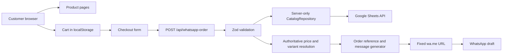

# Complete Workflow — Multilingual WhatsApp E-commerce Website

## 1. Project objective

Build a modern multilingual e-commerce website for physical products.

The website must allow customers to:

1. Browse products.
2. Search and filter by category and subcategory.
3. Select product variants such as size, color, and material.
4. Add products to a cart.
5. Change quantities or remove items.
6. Enter their delivery information.
7. Generate a validated order summary.
8. Open WhatsApp with a prefilled order message containing the selected articles, variants, quantities, prices, customer details, and delivery notes.

The website will not process online payments in the first version.

---

## 2. Final specification based on the questionnaire

| Area | Selected requirement |
|---|---|
| Product type | Physical products |
| Initial catalog size | 30–100 products |
| Product organization | Categories and subcategories |
| Variants | Size, color, material, and other product-specific options |
| Product information | Images, descriptions, prices, variants, and stock status |
| Currency | Moroccan dirham — MAD |
| Languages | Arabic, French, and English |
| Default language | French |
| Arabic layout | Full RTL support |
| Visual style | Modern e-commerce |
| Branding | Temporary branding during development |
| Landing page | Hero, categories, featured products, and store benefits |
| Cart | Products, variants, quantities, totals |
| Customer form | Name, phone, city, address, and delivery notes |
| WhatsApp message | Full product and customer information |
| Delivery fee | Confirmed manually through WhatsApp |
| Product management | Google Sheets initially |
| Future product management | Supabase database and protected admin dashboard |
| Additional features | Search, categories, and subcategory filters |
| Development agent | Google Antigravity |
| Review agent | Codex |
| Verification | Codex security review, automated tests, browser tests, dependency scans |
| Deployment | Compare Vercel, Cloudflare, and Netlify; recommended: Vercel Pro |

---

## 3. Recommended delivery strategy

Use two technical phases.

### Phase 1 — Fast and maintainable MVP

```text
Google Sheets
    ↓
Server-only catalog repository
    ↓
Next.js storefront
    ↓
Validated server-side order generation
    ↓
WhatsApp
```

This phase is appropriate for 30–100 products and avoids building an admin dashboard before it is necessary.

### Phase 2 — Production growth architecture

```text
Supabase PostgreSQL
    ↓
Row-level security
    ↓
Protected admin dashboard
    ↓
Catalog and inventory management
    ↓
Same storefront and cart
```

The frontend must depend on a `CatalogRepository` interface so the catalog backend can later migrate from Google Sheets to Supabase without rewriting the website.

---

## 4. Recommended technology stack

| Layer | Technology |
|---|---|
| Framework | Next.js App Router |
| Language | TypeScript with strict mode |
| Styling | Tailwind CSS |
| Runtime validation | Zod |
| Product catalog | Google Sheets API |
| Future database | Supabase PostgreSQL |
| Cart | `localStorage`, with server-side revalidation |
| Unit testing | Vitest |
| Component testing | Testing Library |
| Browser testing | Playwright |
| Static analysis | ESLint and TypeScript |
| Security scanning | CodeQL, Dependabot, dependency review, `npm audit` |
| Repository | GitHub |
| Primary development agent | Antigravity |
| Independent reviewer | Codex |
| Hosting | Vercel Pro |
| Monitoring | Vercel Observability and Runtime Logs |

---

## 5. Core architecture



### Trust boundaries

The following must always be considered untrusted:

- Browser form values.
- `localStorage`.
- Query parameters.
- Locale parameters.
- Google Sheets rows.
- Product image URLs.
- Customer notes.
- Product IDs and variant IDs received from the browser.
- AI-generated code.
- Third-party npm dependencies.

The server must be authoritative for:

- Product existence.
- Product availability.
- Variant ownership.
- Price.
- Quantity validation.
- WhatsApp destination number.
- Order-reference generation.
- Final order-message content.

---

## 6. Mandatory security decision

The browser must send only:

```ts
interface CartItem {
  productId: string;
  variantId: string;
  quantity: number;
}
```

The browser must not be trusted for:

```text
Price
Discount
Subtotal
Total
Availability
Variant ownership
WhatsApp destination
Delivery price
```

The server must fetch the current catalog and recalculate every amount before producing the WhatsApp message.

---

## 7. Privacy decision for WhatsApp checkout

A WhatsApp click-to-chat message is encoded inside a URL query string.

Including the full customer address and notes in that URL can expose them through:

- Browser history.
- Shared-device history.
- Application logs.
- Proxy logs.
- Analytics tools.
- Screenshots.
- Copied or shared URLs.

### Mode A — Required by the current specification

Include:

- Customer name.
- Phone.
- City.
- Full address.
- Delivery notes.
- Product details.
- Quantities.
- Prices.
- Total.

Mandatory controls:

- Never log the complete WhatsApp URL.
- Return `Cache-Control: no-store`.
- Do not store customer information in `localStorage`.
- Do not include customer data in analytics.
- Redact PII in error tracking.
- Do not retain checkout form data after successful redirection.

### Mode B — Recommended privacy upgrade

Create a short-lived order draft on the server or in Supabase.

The WhatsApp message contains:

```text
Order reference
Customer name
Customer phone
City
Products
Variants
Quantities
Total
```

The full address is retrieved internally using the order reference or confirmed in WhatsApp.

Implement Mode A for the first version because it matches the selected requirements, but structure the message builder so Mode B can be enabled later.

---

## 8. Pages and routes

```text
/[lang]
/[lang]/products
/[lang]/products/[slug]
/[lang]/categories/[slug]
/[lang]/cart
/[lang]/checkout
/[lang]/about
/[lang]/contact
/[lang]/privacy
/[lang]/terms
```

Supported locale type:

```ts
export type Locale = "ar" | "fr" | "en";
```

Language direction:

```ts
export const localeDirection = {
  ar: "rtl",
  fr: "ltr",
  en: "ltr",
} as const;
```

Default locale:

```text
fr
```

---

## 9. Landing-page structure

```text
Header
├── Temporary logo
├── Navigation
├── Search
├── Language selector
├── WhatsApp shortcut
└── Cart button

Hero
├── Main offer
├── Supporting text
├── Primary CTA
└── Temporary visual

Featured categories

Featured products

Store benefits
├── Simple ordering
├── WhatsApp confirmation
├── Product support
└── Delivery confirmation

How ordering works
├── Browse
├── Select variants
├── Add to cart
├── Enter delivery information
└── Confirm through WhatsApp

Footer
├── Contact information
├── Social links
├── Privacy policy
├── Terms
└── WhatsApp link
```

---

## 10. Google Sheets data model

Create a spreadsheet named:

```text
Store Catalog
```

### Sheet: `Products`

| Column | Type | Example |
|---|---|---|
| `id` | String | `prod_001` |
| `slug` | String | `classic-tshirt` |
| `active` | Boolean | `TRUE` |
| `category_id` | String | `cat_clothing` |
| `subcategory_id` | String | `sub_tshirts` |
| `name_fr` | String | `T-shirt classique` |
| `name_ar` | String | `قميص كلاسيكي` |
| `name_en` | String | `Classic T-shirt` |
| `description_fr` | String | Product description |
| `description_ar` | String | Product description |
| `description_en` | String | Product description |
| `base_price_mad` | Number | `149` |
| `compare_price_mad` | Number or empty | `179` |
| `image_urls` | String | URLs separated by `|` |
| `stock_status` | Enum | `in_stock` |
| `featured` | Boolean | `TRUE` |
| `sort_order` | Integer | `10` |

### Sheet: `Variants`

| Column | Type | Example |
|---|---|---|
| `id` | String | `var_001` |
| `product_id` | String | `prod_001` |
| `sku` | String | `TS-BLK-M` |
| `size` | String | `M` |
| `color_fr` | String | `Noir` |
| `color_ar` | String | `أسود` |
| `color_en` | String | `Black` |
| `material_fr` | String | `Coton` |
| `material_ar` | String | `قطن` |
| `material_en` | String | `Cotton` |
| `price_adjustment_mad` | Number | `0` |
| `active` | Boolean | `TRUE` |
| `stock_status` | Enum | `in_stock` |

### Sheet: `Categories`

| Column | Type | Example |
|---|---|---|
| `id` | String | `cat_clothing` |
| `parent_id` | String or empty | Empty for root category |
| `slug` | String | `clothing` |
| `name_fr` | String | `Vêtements` |
| `name_ar` | String | `ملابس` |
| `name_en` | String | `Clothing` |
| `image_url` | String | Image URL |
| `active` | Boolean | `TRUE` |
| `sort_order` | Integer | `1` |

### Sheet: `Settings`

| Key | Example |
|---|---|
| `store_name` | `Temporary Store` |
| `whatsapp_number` | `212600000000` |
| `default_locale` | `fr` |
| `currency` | `MAD` |
| `delivery_message_fr` | `Frais de livraison à confirmer` |
| `delivery_message_ar` | `يتم تأكيد رسوم التوصيل` |
| `delivery_message_en` | `Delivery fee to be confirmed` |

---

## 11. Google Cloud setup

1. Create a Google Cloud project.
2. Enable the Google Sheets API.
3. Create a service account.
4. Generate credentials.
5. Copy the service-account email.
6. Share the catalog spreadsheet with the service-account email.
7. Grant read-only access.
8. Store credentials only in server-side environment variables.
9. Rotate credentials periodically.
10. Never commit credentials to Git.

Environment variables:

```env
GOOGLE_SHEETS_SPREADSHEET_ID=
GOOGLE_SERVICE_ACCOUNT_EMAIL=
GOOGLE_PRIVATE_KEY=
WHATSAPP_PHONE_NUMBER=212600000000
NEXT_PUBLIC_STORE_NAME=
NEXT_PUBLIC_DEFAULT_LOCALE=fr
WHATSAPP_MESSAGE_MODE=full
```

Never use:

```env
NEXT_PUBLIC_GOOGLE_PRIVATE_KEY=
NEXT_PUBLIC_GOOGLE_SERVICE_ACCOUNT_EMAIL=
```

---

## 12. Project initialization

Run in the Antigravity terminal:

```bash
npx create-next-app@latest whatsapp-store \
  --typescript \
  --tailwind \
  --eslint \
  --app \
  --src-dir \
  --import-alias "@/*"

cd whatsapp-store
```

Install dependencies:

```bash
npm install zod googleapis lucide-react server-only
npm install -D vitest @testing-library/react @testing-library/jest-dom
npm install -D @playwright/test
npx playwright install
```

Initialize Git:

```bash
git init
git add .
git commit -m "chore: initialize multilingual WhatsApp storefront"
```

Create the remote repository and push:

```bash
git branch -M main
git remote add origin <GITHUB_REPOSITORY_URL>
git push -u origin main
```

---

## 13. Recommended folder structure

```text
whatsapp-store/
├── .github/
│   ├── workflows/
│   │   ├── ci.yml
│   │   └── codeql.yml
│   └── dependabot.yml
├── e2e/
│   ├── catalog.spec.ts
│   ├── cart.spec.ts
│   ├── checkout.spec.ts
│   ├── localization.spec.ts
│   ├── accessibility.spec.ts
│   └── security.spec.ts
├── public/
│   ├── brand/
│   └── placeholders/
├── src/
│   ├── app/
│   │   ├── api/
│   │   │   └── whatsapp-order/
│   │   │       └── route.ts
│   │   ├── [lang]/
│   │   │   ├── layout.tsx
│   │   │   ├── page.tsx
│   │   │   ├── products/
│   │   │   │   ├── page.tsx
│   │   │   │   └── [slug]/
│   │   │   │       └── page.tsx
│   │   │   ├── categories/
│   │   │   │   └── [slug]/
│   │   │   │       └── page.tsx
│   │   │   ├── cart/
│   │   │   │   └── page.tsx
│   │   │   ├── checkout/
│   │   │   │   └── page.tsx
│   │   │   ├── about/
│   │   │   │   └── page.tsx
│   │   │   ├── contact/
│   │   │   │   └── page.tsx
│   │   │   ├── privacy/
│   │   │   │   └── page.tsx
│   │   │   └── terms/
│   │   │       └── page.tsx
│   │   └── globals.css
│   ├── components/
│   │   ├── cart/
│   │   ├── catalog/
│   │   ├── checkout/
│   │   ├── layout/
│   │   └── ui/
│   ├── config/
│   │   ├── locales.ts
│   │   └── store.ts
│   ├── context/
│   │   └── cart-context.tsx
│   ├── dictionaries/
│   │   ├── ar.json
│   │   ├── en.json
│   │   └── fr.json
│   ├── lib/
│   │   ├── catalog/
│   │   │   ├── repository.ts
│   │   │   ├── sheets-repository.ts
│   │   │   ├── mapper.ts
│   │   │   └── schemas.ts
│   │   ├── cart/
│   │   │   ├── cart-schema.ts
│   │   │   └── cart-utils.ts
│   │   ├── orders/
│   │   │   ├── order-schema.ts
│   │   │   ├── resolve-order.ts
│   │   │   ├── order-reference.ts
│   │   │   └── whatsapp-message.ts
│   │   ├── security/
│   │   │   ├── origin.ts
│   │   │   ├── sanitize.ts
│   │   │   └── rate-limit.ts
│   │   ├── google-sheets.ts
│   │   └── utils.ts
│   ├── types/
│   │   ├── catalog.ts
│   │   ├── cart.ts
│   │   └── order.ts
│   └── proxy.ts
├── AGENTS.md
├── .env.example
├── playwright.config.ts
├── vitest.config.ts
├── next.config.ts
└── package.json
```

---

## 14. Catalog repository abstraction

```ts
export interface CatalogRepository {
  getProducts(): Promise<Product[]>;
  getProductById(id: string): Promise<Product | null>;
  getProductBySlug(slug: string): Promise<Product | null>;
  getCategories(): Promise<Category[]>;
  getVariants(productId: string): Promise<ProductVariant[]>;
  getCatalogBundle(): Promise<CatalogBundle>;
}
```

Initial implementation:

```text
CatalogRepository
└── GoogleSheetsCatalogRepository
```

Future implementation:

```text
CatalogRepository
└── SupabaseCatalogRepository
```

Rules:

- UI components never call Google Sheets directly.
- All Google Sheets code imports `server-only`.
- Every row is validated with Zod.
- Malformed rows are rejected or excluded safely.
- No catalog text is rendered as raw HTML.
- No arbitrary image domain is accepted.

---

## 15. Cart implementation

### Cart type

```ts
export interface CartItem {
  productId: string;
  variantId: string;
  quantity: number;
}
```

### Storage

```text
Key: store-cart-v1
Storage: localStorage
```

### Cart rules

- Minimum quantity: `1`.
- Maximum quantity: `99`.
- Quantities must be integers.
- Same product and same variant are merged.
- Different variants create separate lines.
- Invalid stored data is discarded.
- Prices in local storage are never trusted.
- Customer details are not persisted in local storage.
- Empty carts cannot be submitted.
- Inactive or unavailable products are removed or blocked at checkout.

### Required functions

```ts
addItem(item)
removeItem(productId, variantId)
setQuantity(productId, variantId, quantity)
clearCart()
mergeDuplicateLines()
validateStoredCart()
getItemCount()
```

---

## 16. Checkout request contract

```ts
interface CheckoutRequest {
  locale: "ar" | "fr" | "en";

  customer: {
    name: string;
    phone: string;
    city: string;
    address: string;
    notes?: string;
  };

  items: Array<{
    productId: string;
    variantId: string;
    quantity: number;
  }>;
}
```

Validation limits:

| Field | Rule |
|---|---|
| `name` | 1–100 characters |
| `phone` | 6–30 characters |
| `city` | 1–100 characters |
| `address` | 1–250 characters |
| `notes` | Maximum 500 characters |
| `items` | 1–100 items |
| `quantity` | Integer from 1 to 99 |
| `locale` | Only `ar`, `fr`, or `en` |

Remove dangerous bidirectional-control characters from customer-controlled text before generating Arabic or mixed-direction output.

---

## 17. Server-side order-generation algorithm

```text
1. Receive POST request.
2. Verify request origin.
3. Verify Fetch Metadata headers when available.
4. Apply rate limiting.
5. Parse JSON.
6. Validate schema with Zod.
7. Load current catalog from the server repository.
8. Validate every product ID.
9. Validate every variant ID.
10. Verify that each variant belongs to the selected product.
11. Verify product and variant are active.
12. Verify stock status.
13. Recalculate unit price.
14. Recalculate line totals.
15. Recalculate subtotal.
16. Generate a unique order reference.
17. Generate localized WhatsApp text.
18. Use the fixed server-side WhatsApp number.
19. Return the URL with `Cache-Control: no-store`.
20. Do not log customer PII or the complete WhatsApp URL.
```

---

## 18. WhatsApp message format

### French example

```text
🛍️ Nouvelle commande — #WA-20260727-A8F2

CLIENT
Nom : Ahmed Amine
Téléphone : 0612345678
Ville : Rabat
Adresse : Hay Riad, Rabat
Notes : Merci d'appeler avant la livraison

ARTICLES

1. T-shirt classique
   Variante : Noir / M / Coton
   Référence : TS-BLK-M
   Prix unitaire : 149 MAD
   Quantité : 2
   Total : 298 MAD

2. Chaussures de sport
   Variante : Blanc / 42
   Référence : SH-WHT-42
   Prix unitaire : 399 MAD
   Quantité : 1
   Total : 399 MAD

SOUS-TOTAL : 697 MAD
LIVRAISON : À confirmer sur WhatsApp
TOTAL AVANT LIVRAISON : 697 MAD

Merci de confirmer la disponibilité et les frais de livraison.
```

### URL generation

```ts
const url =
  `https://wa.me/${configuredPhone}` +
  `?text=${encodeURIComponent(message)}`;
```

Rules:

- The hostname is always `wa.me`.
- The phone number comes only from server configuration.
- The customer cannot select or modify the destination number.
- The complete URL must not appear in logs.
- The server response must be marked `no-store`.

---

## 19. Localization and RTL workflow

### Shared dictionaries

```text
src/dictionaries/ar.json
src/dictionaries/fr.json
src/dictionaries/en.json
```

### Rules

- Do not create three separate component trees.
- Use shared components with locale dictionaries.
- Set `<html lang>` correctly.
- Set `dir="rtl"` for Arabic.
- Set `dir="ltr"` for French and English.
- Format currency with `Intl.NumberFormat`.
- Isolate phone numbers, SKUs, and prices inside Arabic pages using `<bdi>`.
- Test layout mirroring.
- Avoid directional CSS such as `margin-left` where logical properties can be used.
- Prefer `margin-inline-start`, `padding-inline`, `inset-inline`, and flex/grid layouts.

---

## 20. Search and filtering

Required filters:

- Category.
- Subcategory.
- Stock status.
- Optional price range.
- Search by localized product name.
- Search by SKU where appropriate.

Implementation rules:

- Search must work in Arabic, French, and English.
- Normalize search text.
- Debounce client-side search input.
- Do not call Google Sheets on every keystroke.
- Fetch or cache the catalog bundle once, then filter locally or server-side.
- Keep filter state in URL query parameters when useful.
- Validate all filter parameters.

---

## 21. Google Sheets performance strategy

For 30–100 products:

- Use `batchGet`.
- Read product, category, variant, and settings ranges in one logical request.
- Cache normalized catalog data.
- Revalidate every 60–300 seconds.
- Use a request timeout.
- Use exponential backoff on `429`.
- Keep a stale catalog fallback for temporary API failures.
- Do not fetch Sheets directly from the browser.
- Do not fetch Sheets separately for each product card.
- Avoid synchronous heavy processing in request handlers.

Recommended catalog flow:

```text
Google Sheets batchGet
    ↓
Zod row validation
    ↓
Normalized catalog bundle
    ↓
Server cache
    ↓
Pages and checkout
```

---

## 22. Security controls

### Application integrity

- Server-side price calculation.
- Product/variant relationship validation.
- Quantity limits.
- Strict request schemas.
- Fixed WhatsApp destination.
- Same-origin checks.
- Fetch Metadata checks.
- Rate limiting.
- Generic production errors.
- No PII in logs.
- No secrets in browser bundles.

### XSS prevention

- Never use `dangerouslySetInnerHTML`.
- Treat Google Sheets as untrusted input.
- Render product descriptions as plain text.
- Validate links and URL schemes.
- Reject `javascript:` URLs.
- Add a Content Security Policy.
- Escape output through React rendering.

### Image security

- Use strict Next.js `remotePatterns`.
- Prefer a controlled image host.
- Reject arbitrary domains from Sheets.
- Consider moving images to Supabase Storage later.
- Restrict protocols to HTTPS.
- Define maximum image dimensions and sizes where possible.

### Secrets

- Use server-only modules.
- Store secrets in Vercel environment variables.
- Keep `.env*` ignored.
- Commit only `.env.example`.
- Rotate the Google service-account key.
- Grant read-only Sheets access.
- Never paste production secrets into AI prompts or screenshots.

### Logging

Log:

- Request ID.
- Order reference.
- Locale.
- Item count.
- Product IDs.
- Response status.
- Duration.
- Sheets error category.
- Rate-limit decision.

Do not log:

- Full name.
- Full phone number.
- Full address.
- Delivery notes.
- Complete WhatsApp URL.
- Google credentials.
- Raw request body.

---

## 23. Security headers

Configure:

```text
Content-Security-Policy
Referrer-Policy
X-Content-Type-Options
X-Frame-Options or frame-ancestors
Permissions-Policy
Strict-Transport-Security in production
```

Recommended baseline:

```text
default-src 'self'
base-uri 'self'
frame-ancestors 'none'
object-src 'none'
script-src 'self'
style-src 'self'
img-src 'self' https://approved-image-host.example data:
connect-src 'self'
form-action 'self' https://wa.me https://api.whatsapp.com
upgrade-insecure-requests
```

Test the final policy against the deployed application before enforcing it strictly.

---

## 24. Rate limiting and abuse controls

Protect:

```text
POST /api/whatsapp-order
```

Suggested initial policy:

```text
Per IP:
- 10 order-generation requests per minute
- 50 per hour

Per browser/session identifier:
- 5 rapid requests per minute

Payload:
- Maximum request size
- Maximum 100 cart lines
- Maximum 500 characters in notes
```

Additional controls:

- Same-origin verification.
- `Sec-Fetch-Site` verification.
- Bot and abuse monitoring.
- WAF rules.
- Alert on abnormal request spikes.
- Do not expose whether a product ID exists through detailed public errors.

---

## 25. Unit tests

Create tests for:

### Catalog

- Valid Google Sheets product row.
- Malformed product row.
- Invalid price.
- Duplicate IDs.
- Invalid category relationship.
- Variant linked to missing product.
- Inactive product.
- Out-of-stock variant.
- Invalid image domain.

### Cart

- Add item.
- Merge duplicate variant.
- Different variants remain separate.
- Quantity boundaries.
- Invalid local-storage JSON.
- Extra fields are ignored or rejected.
- Cart persists after refresh.
- Cart clears successfully.

### Orders

- Valid order resolution.
- Server recalculates price.
- Client price fields are rejected.
- Variant belongs to another product.
- Product is inactive.
- Variant is inactive.
- Product is unavailable.
- Invalid quantity.
- Order reference format.
- WhatsApp formatting in all languages.
- Bidi-control characters removed.
- Fixed WhatsApp destination.

### Localization

- Currency formatting.
- French labels.
- English labels.
- Arabic labels.
- Arabic direction.
- Missing translation detection.

---

## 26. Playwright end-to-end tests

### Main flow

1. Open French landing page.
2. Navigate through categories.
3. Search for a product.
4. Open product details.
5. Select all required variants.
6. Add product to cart.
7. Change quantity.
8. Refresh and verify persistence.
9. Add another product.
10. Remove one item.
11. Open checkout.
12. Fill customer data.
13. Submit.
14. Verify `/api/whatsapp-order`.
15. Verify returned host is `wa.me`.
16. Verify message contains correct products and totals.

### Security flow

- Modify `localStorage`.
- Add unknown product ID.
- Use a variant belonging to another product.
- Add quantity `0`.
- Add quantity `100`.
- Submit extra fields.
- Try attacker-controlled WhatsApp number.
- Add HTML in customer notes.
- Add bidi override characters.
- Send oversized notes.
- Trigger cross-site request.
- Trigger repeated requests.
- Verify no PII appears in browser console.
- Verify response uses `no-store`.

### Localization flow

- Arabic page has `dir="rtl"`.
- French page has `dir="ltr"`.
- English page has `dir="ltr"`.
- Currency uses MAD.
- SKUs display correctly in Arabic.
- Language switching preserves the relevant page.

### Responsive flow

Test:

```text
375 × 667
390 × 844
768 × 1024
1440 × 900
```

---

## 27. Accessibility checklist

Target WCAG 2.2 AA where practical.

- Keyboard-accessible navigation.
- Visible focus states.
- Semantic headings.
- Proper labels for every input.
- Error messages associated with fields.
- Alternative text for product images.
- Sufficient contrast.
- No color-only state communication.
- Accessible cart quantity controls.
- Accessible language switcher.
- Correct `lang` and `dir`.
- Skip-to-content link.
- Reduced-motion support.
- Minimum touch-target sizes.
- Screen-reader-friendly price and quantity announcements.
- Modal or drawer focus trapping where used.

Run:

```text
Playwright accessibility checks
Lighthouse
Manual keyboard test
Screen-reader spot check
```

---

## 28. Performance checklist

### Images

- Use `next/image`.
- Define width and height.
- Use responsive `sizes`.
- Lazy-load below-the-fold images.
- Optimize hero image priority.
- Restrict image domains.
- Use modern formats where supported.

### Rendering

- Keep most catalog pages server-rendered or statically generated.
- Avoid unnecessary client components.
- Keep cart and interactive controls client-side.
- Cache catalog data.
- Avoid repeated Sheets calls.
- Avoid blocking Node.js operations.
- Avoid large client-side libraries.

### Core Web Vitals

Target:

```text
LCP: under 2.5 seconds
INP: under 200 ms
CLS: under 0.1
```

### Bundle control

- Use bundle analysis.
- Remove unused dependencies.
- Prefer native APIs.
- Dynamically import non-critical components.
- Avoid shipping Google API libraries to the browser.

---

## 29. SEO checklist

- Localized page titles.
- Localized descriptions.
- Canonical URLs.
- `hreflang` for `ar`, `fr`, and `en`.
- Product structured data.
- Organization structured data.
- Breadcrumb structured data.
- Sitemap.
- `robots.txt`.
- Open Graph metadata.
- Social preview images.
- Descriptive product URLs.
- Server-rendered product content.
- No duplicate locale content without alternates.
- Correct status codes for missing products.
- Redirect inactive product URLs deliberately.

---

## 30. CI/CD workflow

Every pull request must run:

```text
npm ci
npm run lint
npm run typecheck
npm run test
npm run build
npm run test:e2e
npm audit --audit-level=high
npm audit signatures
Dependency review
CodeQL
```

Suggested scripts:

```json
{
  "scripts": {
    "dev": "next dev",
    "build": "next build",
    "start": "next start",
    "lint": "eslint .",
    "typecheck": "tsc --noEmit",
    "test": "vitest run",
    "test:watch": "vitest",
    "test:e2e": "playwright test",
    "verify": "npm run lint && npm run typecheck && npm run test && npm run build"
  }
}
```

Branch protection:

- Require pull request.
- Require passing CI.
- Require review before merge.
- Block direct pushes to `main`.
- Require resolved review comments.
- Require up-to-date branch.
- Enable secret scanning.
- Enable Dependabot.
- Enable CodeQL.
- Enable dependency review.

---

## 31. Antigravity development workflow

### Recommended settings

```text
Mode: Planning Mode
Artifact review: Request Review
Security mode: Strict
Terminal sandbox: Enabled
Browser: Isolated profile
Secret-file access: Request Review
Automatic deployment: Disabled until verification
```

### Execution workflow

```text
1. Inspect repository.
2. Read AGENTS.md.
3. Produce implementation plan.
4. Produce architecture diagram.
5. Identify trust boundaries.
6. List files to create or modify.
7. Request review.
8. Implement one milestone at a time.
9. Run tests after each milestone.
10. Commit each milestone separately.
11. Verify browser behavior.
12. Push branch.
13. Open pull request.
14. Hand off to Codex.
15. Fix confirmed findings.
16. Re-run verification.
17. Deploy preview.
18. Verify preview.
19. Merge after approval.
20. Deploy production.
```

---

## 32. Master prompt for Antigravity

```text
You are the principal engineer responsible for building a production-ready
multilingual WhatsApp-commerce storefront.

PROJECT

Build a modern e-commerce website for 30–100 physical products.

The website does not process online payments. Customers browse products,
select variants, add items to a cart, enter delivery information, and are
redirected to WhatsApp with a complete prefilled order message.

REQUIREMENTS

- Products organized by categories and subcategories.
- Multiple variants: size, color, material, and SKU.
- Product images, descriptions, prices, stock status, and featured state.
- Currency: MAD.
- Languages: Arabic, French, and English.
- French is the default language.
- Arabic uses full RTL.
- Modern e-commerce design.
- Temporary branding using CSS variables.
- Landing page with hero, categories, featured products, and benefits.
- Search and category/subcategory filtering.
- Cart with product variants and quantities.
- Checkout form with name, phone, city, address, and delivery notes.
- Delivery cost is confirmed manually through WhatsApp.
- Google Sheets is the initial catalog backend.
- The architecture must allow migration to Supabase.

TECHNOLOGY

- Current stable Next.js App Router.
- TypeScript strict mode.
- Tailwind CSS.
- Zod.
- Google Sheets API.
- Server-only Google service-account access.
- localStorage cart.
- Vitest.
- Playwright.
- GitHub Actions.
- Vercel-compatible deployment.

ARCHITECTURE

Create a CatalogRepository interface.

Implement GoogleSheetsCatalogRepository.

React components must never call Google Sheets directly.

Treat browser data, localStorage, Sheets rows, query parameters, image URLs,
and customer notes as untrusted.

CART

Store only:

- productId
- variantId
- quantity

Do not trust browser prices.

Merge identical product and variant combinations.

Quantities must be integers from 1 to 99.

CHECKOUT

Create POST /api/whatsapp-order.

The endpoint must:

1. Validate the request using Zod.
2. Verify origin and Fetch Metadata.
3. Apply rate limiting.
4. Fetch current server-side catalog data.
5. Verify every product.
6. Verify every variant belongs to its product.
7. Reject inactive or unavailable entries.
8. Recalculate prices server-side.
9. Generate a unique readable order reference.
10. Generate a localized WhatsApp message.
11. Use a fixed server-side WhatsApp number.
12. Never accept prices or destination number from the client.
13. Return Cache-Control: no-store.
14. Never log customer PII or the complete WhatsApp URL.

SECURITY

- No Google credentials in browser code.
- No NEXT_PUBLIC secrets.
- No dangerouslySetInnerHTML.
- No arbitrary image domains.
- No raw HTML from Sheets.
- Strict security headers.
- Content Security Policy.
- Redacted structured logs.
- Same-origin protection.
- Rate limiting.
- Dependabot.
- Dependency review.
- CodeQL.
- npm audit.
- Tampering tests.

LOCALIZATION

- /ar uses RTL.
- /fr uses LTR and is default.
- /en uses LTR.
- Shared component tree.
- Locale dictionaries.
- Intl.NumberFormat for MAD.
- Use bdi for phone numbers, prices, and SKUs in Arabic UI.
- Strip dangerous bidi-control characters from untrusted text.

PERFORMANCE

- Use Google Sheets batchGet.
- Cache normalized catalog data.
- Add timeout and exponential backoff.
- Avoid Sheets calls on every product card or search keystroke.
- Use next/image with strict remotePatterns.
- Minimize client components.
- Test Core Web Vitals.

TESTS

Create unit tests for:

- Sheets parsing.
- Catalog validation.
- Product/variant relationships.
- Cart merging.
- Quantity limits.
- Price recalculation.
- WhatsApp formatting.
- Bidi sanitization.
- Locale behavior.

Create Playwright tests for:

- French purchase flow.
- Arabic RTL flow.
- English flow.
- Search and filters.
- Variant selection.
- Cart persistence.
- Checkout.
- WhatsApp URL generation.
- Tampered localStorage.
- Invalid product IDs.
- Mismatched variants.
- Oversized input.
- Cross-site submission.
- Mobile layout.
- Accessibility.

WORKFLOW

1. Inspect repository.
2. Read AGENTS.md.
3. Produce an implementation-plan artifact.
4. Produce a data-flow diagram.
5. List security boundaries.
6. List all files to create or modify.
7. Request approval before implementation.
8. Implement in small milestones and commits.
9. Run lint, typecheck, unit tests, Playwright tests, audit, and production build.
10. Verify desktop, tablet, and mobile in the browser.
11. Produce screenshots and traces.
12. Produce a final verification report.
13. Do not claim success unless every required check actually passes.
```

---

## 33. Codex review workflow

Antigravity builds. Codex independently reviews.

```text
Antigravity branch
    ↓
Implementation
    ↓
Local tests
    ↓
GitHub pull request
    ↓
Codex architecture review
    ↓
Codex security review
    ↓
Antigravity fixes
    ↓
Codex final review
    ↓
Merge
```

### Codex architecture-review prompt

```text
Review this repository and the current pull-request diff as an independent
senior Next.js and TypeScript engineer.

Do not modify files during the first pass.

Check:

1. Compliance with AGENTS.md.
2. Next.js server/client boundaries.
3. CatalogRepository isolation.
4. Google Sheets parsing and caching.
5. TypeScript correctness.
6. Product and variant relationships.
7. Localization completeness.
8. Arabic RTL correctness.
9. Cart consistency and persistence.
10. Checkout validation.
11. Server-side price calculation.
12. WhatsApp message correctness.
13. Error handling.
14. Accessibility.
15. Mobile responsiveness.
16. Performance.
17. Missing or weak tests.
18. Deployment configuration.

Report only concrete findings.

For every finding include:

- Severity.
- File and line.
- Defect explanation.
- Reproduction scenario.
- Impact.
- Exact correction.
- Regression test.

Separate findings into:

- Blocking.
- High priority.
- Medium priority.
- Optional.
```

### Codex security-review prompt

```text
Perform a security-focused review of this multilingual WhatsApp-commerce
application.

Treat the browser, localStorage, request bodies, query parameters, Google
Sheets rows, product image URLs, locale paths, environment variables, npm
dependencies, and AI-generated code as untrusted.

Inspect specifically for:

- Exposed service-account credentials.
- Secrets in client bundles.
- Client-controlled prices.
- Product/variant mismatches.
- Inactive or unavailable item checkout.
- Quantity manipulation.
- Invalid numeric values.
- XSS.
- Raw HTML rendering.
- Unsafe URL schemes.
- SSRF-like image fetching.
- Attacker-controlled WhatsApp destination.
- Open redirects.
- Sensitive data in logs.
- Complete wa.me URLs in logs.
- Missing no-store headers.
- Missing same-origin verification.
- Missing Fetch Metadata checks.
- Missing rate limits.
- Denial-of-service risks.
- Event-loop blocking.
- Weak CSP.
- Missing security headers.
- Locale manipulation.
- RTL/bidi spoofing.
- Cache leakage.
- Dependency vulnerabilities.
- GitHub Actions supply-chain risks.
- Missing tampering tests.

Validate findings by running relevant tests where safe.

Do not report a theoretical issue without identifying an actual code path.

For each valid issue provide:

1. Severity.
2. Attack precondition.
3. Exploit path.
4. Impact.
5. Evidence.
6. Minimal fix.
7. Regression test.

Finish with exactly one verdict:

- APPROVED
- APPROVED WITH NON-BLOCKING FINDINGS
- CHANGES REQUIRED
```

---

## 34. AGENTS.md content

```md
# Project Rules

## Purpose

This repository contains a multilingual product storefront that converts a
validated shopping cart into a prefilled WhatsApp order.

## Supported locales

- ar: Arabic, RTL
- fr: French, LTR, default
- en: English, LTR

## Currency

All prices use Moroccan dirham, MAD.

## Architecture

UI components must not access Google Sheets directly.

All catalog access must go through CatalogRepository.

Client cart data is untrusted.

The server must resolve current products, variants, stock, and prices before
generating an order.

## Security

- Never expose service-account credentials.
- Never commit .env files.
- Never trust client-supplied prices.
- Never accept a WhatsApp destination from the client.
- Never render raw HTML originating from Google Sheets.
- Never log customer address, phone, notes, or the full WhatsApp URL.
- Validate all external data with Zod.
- Keep quantities between 1 and 99.
- Keep order URL generation on the server.
- Apply same-origin checks and rate limiting.
- Use strict image allowlists.
- Preserve RTL correctness and strip dangerous bidi controls.

## Quality gates

Before declaring a task complete, run:

npm run lint
npm run typecheck
npm run test
npm run test:e2e
npm run build
npm audit --audit-level=high
npm audit signatures

## Scope discipline

Do not introduce:

- Online payments.
- Customer accounts.
- A custom admin dashboard.
- Supabase.
- Analytics trackers.
- Marketing pixels.
- External CMS systems.

unless explicitly requested.
```

---

## 35. Implementation milestones

### Milestone 0 — Repository and governance

- Initialize repository.
- Add `AGENTS.md`.
- Add branch protection.
- Add `.env.example`.
- Add CI.
- Add Dependabot.
- Add CodeQL.
- Define acceptance criteria.

### Milestone 1 — Foundation

- Next.js setup.
- TypeScript strict mode.
- Tailwind tokens.
- Shared layout.
- Locale routing.
- Arabic RTL.
- Temporary branding.
- Header and footer.
- Basic metadata.

### Milestone 2 — Catalog

- Google Sheets setup.
- Repository interface.
- Zod schemas.
- `batchGet`.
- Cache.
- Categories.
- Subcategories.
- Product cards.
- Product pages.
- Search.
- Filters.
- Loading and error states.

### Milestone 3 — Cart

- Variant selection.
- Add-to-cart flow.
- Cart persistence.
- Quantity controls.
- Item removal.
- Empty state.
- Totals for display.
- Tampered-storage validation.

### Milestone 4 — Checkout and WhatsApp

- Customer form.
- Checkout schema.
- Origin checks.
- Rate limiting.
- Server-side product resolution.
- Server-side price calculation.
- Order-reference generation.
- Localized WhatsApp messages.
- Fixed WhatsApp destination.
- `no-store` response.
- PII-safe logging.

### Milestone 5 — Security hardening

- CSP.
- Security headers.
- Strict image host allowlist.
- Error redaction.
- Abuse alerts.
- Dependency review.
- CodeQL.
- `npm audit`.
- Codex security review.
- Fix all blocking findings.

### Milestone 6 — Quality

- Unit tests.
- End-to-end tests.
- Accessibility audit.
- RTL verification.
- Mobile verification.
- Performance profiling.
- Lighthouse.
- SEO metadata.
- Sitemap and robots.

### Milestone 7 — Production

- Add real branding.
- Add real WhatsApp number.
- Populate real products.
- Configure custom domain.
- Configure Vercel Pro.
- Add production environment variables.
- Run final security review.
- Run final browser test.
- Deploy.
- Monitor initial traffic.
- Keep rollback ready.

---

## 36. Hosting decision

### Recommended: Vercel Pro

Use Vercel Pro because:

- It has the simplest Next.js deployment path.
- Preview deployments integrate well with pull requests.
- Runtime logs and observability are available.
- WAF and rate limiting can protect the order endpoint.
- Environment-variable management is straightforward.
- Rollback is simple.

Do not use a free personal-only plan for the final commercial deployment.

### Alternatives

| Platform | Appropriate when |
|---|---|
| Cloudflare | You want edge infrastructure and accept additional compatibility testing |
| Netlify | Your team already uses Netlify and confirms all Next.js features |
| VPS | You have Linux, networking, patching, monitoring, and incident-response experience |

---

## 37. Deployment workflow

```text
1. Merge verified pull request into main.
2. Vercel creates production deployment.
3. Run smoke tests.
4. Run Playwright against production.
5. Verify environment variables.
6. Verify CSP.
7. Verify security headers.
8. Verify robots and sitemap.
9. Verify WhatsApp number.
10. Verify Arabic, French, and English.
11. Verify mobile checkout.
12. Verify no PII appears in logs.
13. Verify rate limiting.
14. Record deployment commit.
15. Keep previous deployment available for rollback.
```

---

## 38. Monitoring

Monitor:

- Checkout endpoint request count.
- 400, 403, 429, and 500 rates.
- Google Sheets timeouts.
- Google Sheets `429` responses.
- Order-message generation duration.
- Unexpected large payloads.
- Unusual locale paths.
- WAF blocks.
- Dependency alerts.
- Production build failures.
- Core Web Vitals.
- Broken product images.
- Missing translation errors.

Alert conditions:

```text
Order endpoint traffic exceeds normal baseline by 3×
Checkout 5xx rate exceeds 1%
Google Sheets failures exceed 5% for five minutes
Repeated rate-limit events from one source
New high or critical dependency alert
Production LCP exceeds 2.5 seconds
```

---

## 39. Incident-response workflow

### Detection

- Confirm alert.
- Identify affected route.
- Identify deployment commit.
- Determine whether PII or credentials were exposed.

### Containment

- Block abusive traffic.
- Disable affected route if necessary.
- Roll back deployment.
- Rotate Google service-account key if exposed.
- Remove leaked secrets from Vercel and GitHub.
- Revoke compromised credentials.

### Recovery

- Patch the issue.
- Add a regression test.
- Run full CI.
- Request Codex security review.
- Deploy preview.
- Verify.
- Redeploy production.

### Post-incident

- Document root cause.
- Document impact.
- Update threat model.
- Update `AGENTS.md`.
- Add monitoring or tests that would detect the issue earlier.

---

## 40. Supabase migration trigger

Migrate from Google Sheets when one or more of these become true:

- More than 100–300 products.
- Frequent inventory changes.
- Multiple administrators.
- Need for protected admin dashboard.
- Need for order-draft storage.
- Need for privacy-safe WhatsApp references.
- Need for transaction-safe stock updates.
- Need for product analytics.
- Need for customer accounts.
- Google Sheets quotas or latency become problematic.

Migration steps:

```text
1. Create Supabase project.
2. Create SQL migrations.
3. Create categories table.
4. Create products table.
5. Create variants table.
6. Create settings table.
7. Create optional order_drafts table.
8. Enable row-level security.
9. Define public read policies.
10. Keep service-role key server-only.
11. Move images to Supabase Storage.
12. Import Sheets data.
13. Implement SupabaseCatalogRepository.
14. Run repository contract tests.
15. Switch dependency injection.
16. Verify storefront behavior.
17. Remove unused Sheets credentials.
```

---

## 41. Definition of done

The project is complete only when:

### Functionality

- Products load from the catalog.
- Categories and subcategories work.
- Search works.
- Filters work.
- Variants are required where appropriate.
- Cart persists after refresh.
- Quantity changes work.
- Customer form validates.
- WhatsApp message is correct.
- Delivery is marked as manually confirmed.

### Localization

- Arabic works.
- French works.
- English works.
- Arabic is RTL.
- All visible text is translated.
- MAD formatting is correct.
- SKUs and phone numbers display correctly in Arabic.

### Security

- No credentials appear in client bundles.
- Prices are recalculated server-side.
- Variant ownership is verified.
- Invalid products are rejected.
- Fixed WhatsApp destination is used.
- Same-origin checks exist.
- Rate limiting exists.
- PII is not logged.
- Complete WhatsApp URL is not logged.
- Security headers are present.
- CSP is present.
- Image hosts are restricted.
- No high or critical vulnerability remains unexplained.

### Quality

- Lint passes.
- Type checking passes.
- Unit tests pass.
- Playwright tests pass.
- Production build passes.
- Accessibility checks pass.
- Mobile views are verified.
- Performance targets are acceptable.
- Codex verdict is `APPROVED` or `APPROVED WITH NON-BLOCKING FINDINGS`.

### Operations

- Production uses an appropriate commercial hosting plan.
- Monitoring is enabled.
- Alerts are configured.
- Rollback is documented.
- Secrets are stored securely.
- Real branding and product data are present.

---

## 42. Final recommended execution order

```text
1. Create GitHub repository.
2. Create AGENTS.md.
3. Configure branch protection and security scanning.
4. Start Antigravity in Planning Mode.
5. Paste the master prompt.
6. Review and approve the architecture plan.
7. Implement Milestone 1.
8. Verify and commit.
9. Implement Milestone 2.
10. Verify and commit.
11. Implement Milestone 3.
12. Verify and commit.
13. Implement Milestone 4.
14. Verify and commit.
15. Implement Milestone 5.
16. Open pull request.
17. Run Codex architecture review.
18. Run Codex security review.
19. Fix confirmed findings.
20. Re-run all tests.
21. Deploy preview.
22. Run Playwright against preview.
23. Add real branding and products.
24. Configure Vercel Pro and domain.
25. Deploy production.
26. Verify production.
27. Monitor initial traffic.
28. Plan Supabase migration only when a real trigger appears.
```

---

## 43. Authoritative references

- OWASP Top 10.
- OWASP Application Security Verification Standard.
- OWASP Business Logic Security Cheat Sheet.
- OWASP Input Validation Cheat Sheet.
- OWASP XSS Prevention Cheat Sheet.
- OWASP CSRF Prevention Cheat Sheet.
- OWASP Logging Cheat Sheet.
- OWASP SSRF Prevention Cheat Sheet.
- OWASP HTTP Headers Cheat Sheet.
- NIST Secure Software Development Framework.
- Next.js data-security documentation.
- Next.js internationalization documentation.
- Next.js image configuration documentation.
- Google Sheets API limits and `batchGet` documentation.
- Google service-account security guidance.
- GitHub CodeQL documentation.
- GitHub dependency-review documentation.
- npm audit documentation.
- Playwright CI and trace documentation.
- W3C bidirectional-text guidance.
- Vercel deployment, WAF, logs, and observability documentation.

---

## 44. Final decision summary

Use:

```text
Antigravity:
- Planning
- Implementation
- Browser verification
- Screenshots
- Milestone commits

Codex:
- Independent architecture review
- Security review
- Test-gap detection
- Pull-request verification

Google Sheets:
- Initial catalog backend
- Read-only service account
- Server-only access
- Cached batch reads

Next.js:
- Storefront
- Multilingual routing
- Server-side validation
- WhatsApp order generation

Vercel Pro:
- Preview deployments
- Production hosting
- Logs
- WAF
- Rate limiting
- Rollback
```

The single most important rule is:

```text
Never trust the browser for products, variants, availability, quantities,
prices, totals, or the WhatsApp destination.
```
